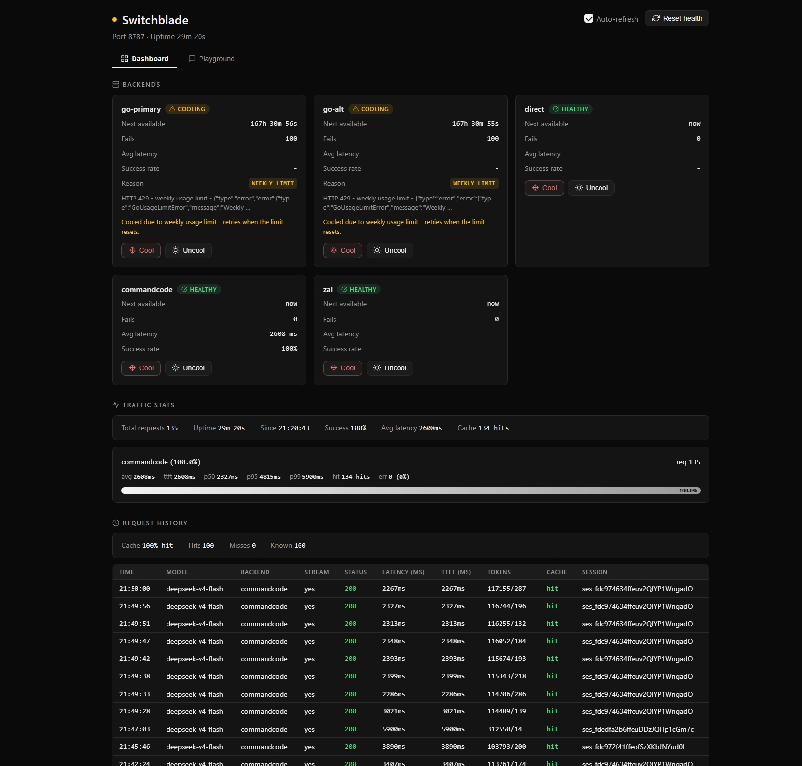

# Switchblade

A zero-dependency, single-file local model router for OpenAI-compatible LLM APIs.
It load-balances requests across multiple upstream providers (OpenCode Go,
DeepSeek, CommandCode, Z.ai, or any OpenAI-compatible endpoint), with
session-affinity hashing, per-provider health tracking, exponential backoff,
and a small web dashboard.

Runs entirely on your machine at `127.0.0.1:8787`. No Redis, no Postgres, no
Kubernetes, no cloud — one Node process, ~125 MB RAM idle, one config file.



## Why

Most self-hosted LLM routers are built for teams and clouds: they pull in a
database, a queue, a container stack, and a big dependency tree to solve
problems a small setup never has. If you have a handful of API keys and want to
spread requests across them with sane fallbacks, that weight is wasted.

This router is the opposite: **two source files, zero dependencies**, and a
config file you can read top to bottom. It was designed from the start to be
maintained by AI agents as much as humans — every behavior is pinned by a
mock-based test suite that runs in seconds with no keys and no network.

## How it works

Three layers:

- **backends** — raw upstream accounts (an OpenCode Go key, a DeepSeek key, a
  CommandCode key, a Z.ai key, or any OpenAI-compatible base URL).
- **models** — logical model ids bound to one or more providers (backend +
  upstream model string). One account can serve many models.
- **presets** — named routing policies over models, exposed to clients as model
  ids. Clients never address backends directly.

Routing is two-level: the preset strategy picks an ordered list of models;
each model then orders its providers by session affinity (pool =
`min(affinityPool, providers.length)`, primary = `hash(sessionKey) % pool`,
rest in declared order). The lists flatten into one attempt list, deduped by
backend, and the router retries through healthy members in order.

### Strategies

- **affinity** (default) — sessions stick to one backend (cache-friendly,
  conversation-coherent) while spreading across the pool. `affinityPool` 1
  degenerates to declared order (failover semantics).
- **failover** — strict declared order; first healthy model/provider serves.
- **weighted** — weighted-random primary, rest sorted by weight desc.

### Health & backoff

Per-backend state machine (`healthy` → `cooling` → healthy on success):

- 429 weekly-limit errors cool until the weekly reset (parses `Resets in N
  days`).
- 429 generic: exponential backoff, 30s base → 10 min cap.
- 5xx/network: 30s base → 5 min cap. 401/403: 1 min base → 30 min cap.
- 400/422 client payload errors: returned immediately, backend NOT cooled.
- Success resets backoff and returns the backend to healthy.

Manual cools (from the UI or `POST /admin/backend`) are **sticky**: they never
participate in the all-cooling fallback and are never cleared by a success.
Only the Uncool action (or a timed `forMs`) restores the backend.

### Timeouts (connect vs idle)

Two independent per-backend bounds, set on the backend entry (or top-level):

- `timeoutMs` / `connectTimeoutMs` — **header wait**: aborts only if the
  upstream has not sent response headers (TTFT) within the bound. Default 45s.
- `idleTimeoutMs` — **stall bound on the body**: aborts only if NO bytes
  arrive for that long during streaming. Default 120s.

A slow-but-alive stream (long thinking, long generation) that keeps emitting
is never cut — the wall-clock body kill that used to terminate SSE relays
exactly at `timeoutMs` is gone. A genuinely stuck upstream (headers then
silence) still fails after `idleTimeoutMs`.

```jsonc
{ "id": "commandcode", "baseURL": "https://api.commandcode.ai/provider/v1",
  "apiKeyEnv": "COMMANDCODE_API_KEY",
  "timeoutMs": 60000, "idleTimeoutMs": 120000 }
```

The old `timeoutMs` value (45s default, 60s on commandcode) previously bounded
the ENTIRE request incl. the body, so long reasoning/generation streams were
aborted mid-flight exactly at the wall clock (see `router.log` "relay error:
The operation was aborted due to timeout").

### Per-model retries

On top of cooling, a model can retry a **transient** failure on the SAME
provider before falling through to the next candidate. This preserves the
session's prompt cache (a fallback backend has zero cached context) and gives
chronically-overloaded free models a chance to catch a free slot.

```jsonc
{
  "models": {
    "laguna-s-2.1-free": {
      "providers": [{ "backend": "commandcode", "upstream": "poolside/laguna-s-2.1-free" }],
      "retry": {
        "maxRetries": 5,   // how many retries before falling through (default 0 = off)
        "baseMs": 2000,    // first retry wait (default 1000)
        "maxMs": 30000,    // per-wait cap (default 8000)
        "multiplier": 2,   // exponential factor (default 2)
        "totalMs": 30000   // total retry-wait budget for one provider (default 15000)
      }
    }
  }
}
```

Retryable failures: 502/503/504, 429 with an `overload` message, network
errors (status 0). NOT retried: 429 weekly limits (GoUsageLimitError), auth
errors, 400/422 client payload errors, and anything that has already started
streaming (a partially-relayed response can never be retried without
duplicating content). Retries never re-cool the backend; `markFailure` runs
once after retries are exhausted, exactly as before. History entries carry
`retries` (count) and `retryWaitedMs` (total ms waited).

### Layered parameters

Params merge from six layers, highest priority last:

```
global < backend.params < provider.params < model.params < preset.params < request body
```

`model` is reserved (always resolved to the provider's upstream string).
Per-provider dialect handling runs after merge: **dropParams first, then
paramMap**, then developer-role translation.

## Install

Requires Node.js 22+ (developed on 25; no Node-25-only APIs are used).

```bash
git clone <your-fork-or-this-repo>
cd switchblade
cp .env.example .env      # add your API keys
```

## Quickstart

1. Add your API keys to `.env` (key names are referenced from `config.json`
   via `apiKeyEnv`). A `.env.example` documents the known ones.
2. Edit `config.json` to your backends/models/presets (see below).
3. Run:

```bash
node server.mjs        # or: npm start
```

The router listens on `http://127.0.0.1:8787/v1`. Open `http://127.0.0.1:8787/`
for the web UI.

Point any OpenAI-compatible client at `http://127.0.0.1:8787/v1` with model =
a preset id. Example:

```bash
curl http://127.0.0.1:8787/v1/chat/completions \
  -H "Content-Type: application/json" \
  -d '{"model":"my-preset","messages":[{"role":"user","content":"hi"}]}'
```

## Config

Top-level keys: `port`, `prefix`, `masterKeyEnv`, `uiPasswordEnv`, `backends`,
`models`, `presets`, optional top-level `params`, `backoff`.

```jsonc
{
  "port": 8787,
  "prefix": "/v1",
  "backends": [
    { "id": "go-1", "baseURL": "https://opencode.ai/zen/go/v1",
      "apiKeyEnv": "OPENCODE_GO_KEY" },
    { "id": "direct", "baseURL": "https://api.deepseek.com/v1",
      "apiKeyEnv": "DEEPSEEK_API_KEY" }
  ],
  "models": {
    "deepseek-v4-flash": {
      "providers": [
        { "backend": "go-1", "upstream": "deepseek-v4-flash" },
        { "backend": "direct", "upstream": "deepseek-v4-flash" }
      ],
      "affinityPool": 2,
      "meta": { "label": "DeepSeek V4 Flash", "contextWindow": 128000,
                "pricing": { "inputPerM": 0.18, "outputPerM": 0.87 } }
    }
  },
  "presets": {
    "flash": { "strategy": "affinity", "models": ["deepseek-v4-flash"] }
  }
}
```

- **backends** — raw accounts: `id`, `baseURL`, `apiKeyEnv` (env var NAME; key
  values live in `.env`, never committed or exposed). Optional: `params`,
  `dropParams`, `translateDeveloperRole`.
- **models** — logical ids: `providers` (`backend` + `upstream` string,
  optional per-provider `params`, `dropParams`, `paramMap`), `affinityPool`
  (default 1), optional `params`, `meta` (label/contextWindow/pricing for the
  UI).
- **presets** — routing policies: `strategy`, `models` (string shorthand or
  `{model, weight}`), optional `affinityPool`, `params`, `meta`.

**Presets of presets (tier nesting):** a preset's `models` array may also
reference other preset ids. The nested preset's model list is expanded in place
at request time (recursively, with cycle detection), and the TOP-LEVEL preset's
strategy governs ordering over the expanded list. A nested preset's own
strategy is ignored — only its model list is taken. This lets you build tiers
that reuse each other:

```jsonc
"presets": {
  "glm":  { "strategy": "failover", "models": ["glm-5.3"] },
  "os-alpha": { "strategy": "affinity", "models": ["deepseek-v4-flash", "mimo-v2.5-pro"] },
  "super": { "strategy": "failover", "models": ["glm", "os-alpha"] }
}
```

`super` routes through `[glm-5.3, deepseek-v4-flash, mimo-v2.5-pro]` in
declared order (failover). Cycles (`A -> B -> A`) are cut with a one-time
warning and never hang the router. See `DESIGN-3LAYER.md` section 3a for the
full contract.

Config hot-reloads via `fs.watch` (~300 ms) — no restart needed. Validate JSON
before saving.

### Backward compatibility

Legacy configs keep working: an old `models[id] = {backends, affinityPool}`
schema and a presets-with-`members` schema both auto-normalize to the
three-layer shape at load, byte-identically for identical effective configs.

## Endpoints

| Method | Path | Purpose |
|--------|------|---------|
| GET | `/health` | per-backend health, state, manual flag |
| GET | `/v1/models` | OpenAI-compatible model list (preset ids) |
| POST | `/v1/chat/completions` | chat completions (stream + non-stream) |
| GET | `/api/stats` | traffic stats |
| GET | `/api/history?limit=N` | request history (default 100, clamp 1..500) |
| GET | `/api/history/detail?t=<timestamp>` or `?call=<callId>` | deep-dive detail for one history entry (payload, attempts, response summary) |
| GET | `/api/config` | normalized config (env NAMES only, never key values) |
| GET | `/api/auth/status` | dashboard auth state (`passwordSet`, `uiAuthed`); never echoes the password |
| POST | `/api/auth/login` | `{password}` -> sets the UI session cookie; 401 wrong password, 429 throttled (5 attempts / 10s per IP) |
| POST | `/api/auth/logout` | clears the UI session cookie |
| GET | `/api/keys` | issued chat-only keys (`id`, `name`, `createdAt`, `revoked`; never hashes or raw values); master key required |
| POST | `/api/keys` | `{name}` -> issues a chat-only key, raw value returned once; master key required |
| DELETE | `/api/keys?id=<id>` | revokes an issued key; master key required |
| POST | `/admin/reset-health` | reset all cooling states |
| POST | `/admin/backend` | `{id, action: "cool"\|"uncool", forMs?}` manual cool/uncool |
| GET | `/` | web UI |

History lives in an in-memory ring buffer (500 entries) and appends to
`router-history.jsonl` (override with `ROUTER_HISTORY`).

## Security

- **Dashboard password** — set `uiPasswordEnv` in `config.json` to the name of
  an env var (`.env`: `LMR_UI_PASSWORD`) to require a login for the web UI.
  When the env var is unset the UI stays open. Login is throttled (5 attempts
  per 10s per client IP) and the session cookie is `HttpOnly`/`SameSite=Strict`.
- **Master key** — `masterKeyEnv` names the env var holding the chat/admin
  master key (`LITELLM_API_KEY` locally, the value dsh and OpenCode already
  send). It gates `POST /v1/chat/completions`, `/admin/*`, and `/api/keys`;
  set-but-empty fails closed.
- **Issued keys are chat-only** — keys created via `POST /api/keys` unlock chat
  completions but never `/admin/*` (admin stays master-key-only). Only SHA-256
  hashes are stored, in `api-keys.json` (gitignored).
- **Read-only endpoints stay open** — `/health`, `/v1/models`, `/api/stats`,
  `/api/history`, `/api/config`, `/api/auth/*`, and `/` never require a key.

### Call IDs

Every request gets a short, stable `callId` (e.g. `c09AlJGPME`), returned in the
`x-router-call` response header, stored on its history entry, and shown as the
**Call** column of the dashboard's request history (with a copy button). Use it
to reference a specific request in conversation, logs, or scripts — the detail
endpoint accepts it as `?call=<callId>` (falling back to `?t=<timestamp>` for
pre-callId rows).

### Request detail deep dive

Click any row in the dashboard's request history to open a slide-out panel with
the full debug picture for that request:

- **Outgoing request payload** — the exact JSON sent upstream (messages
  included, syntax-highlighted). API keys are never part of the payload, so
  nothing sensitive is stored.
- **Per-attempt details** — every backend tried, the upstream model string, the
  status and latency of each attempt, and the raw upstream error body when an
  attempt failed.
- **Response summary** — status, timing (TTFT / total / generation), token
  usage, cache state, and a first-content preview (truncated to 200 chars).

Detail records are stored **in memory only** (never written to
`router-history.jsonl`), capped at **100 records** (oldest dropped). Every
request gets a detail record; oversized bodies (raw payload > 100 KB) are
stored truncated (message content clipped, tool schemas kept to a few) so the
panel never silently 404s. The panel closes via the X button, the Escape key,
or clicking outside.

## Web UI

`index.html` — single file, inline CSS + JS, zero external assets, works
offline. Dashboard: backend cards with live cooling countdowns, traffic stats
with p50/p95/p99 and cache-hit %, presets table, models table, request history
with per-request call IDs (copyable), TTFT/TPS/tokens/cache columns and a
click-to-open detail panel per row, config viewer, and a playground that can
stream a chat, show reasoning, compare models side by side, and export the
conversation.

## Test

```bash
npm test   # node test.mjs
```

The suite (100 assertions) spins up mock backends and router instances on temp
configs — no keys, no network. It covers health, streaming, session affinity,
failover, weighted selection, sticky/timed manual cools, fallback exclusion,
dialect handling, synthesis from both legacy eras, the layered-params merge
order, preset-of-presets nesting (expansion, cycle detection, ordering rules),
per-model retry/backoff, and the request-detail endpoint.

## Design docs

- `DESIGN-3LAYER.md` — the three-layer contract (backends/models/presets,
  routing, layered params, verification checklist).
- `DESIGN-PRESETS.md` — the presets layer and sticky manual-cool semantics.
- `SPEC.md` — original spec and verification plan.

## Contributing

PRs welcome. The rules are simple:

- Keep it zero-dependency. No new npm packages without a strong reason.
- Every behavior change ships with a test in `test.mjs` (mock backends, no
  keys).
- The config contract and its synthesis paths are load-bearing; change them
  only with a documented design note.

## License

MIT. See `LICENSE`.
